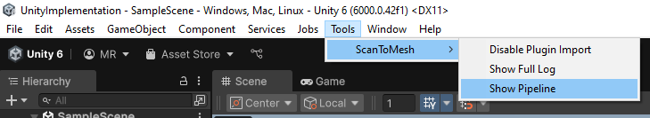
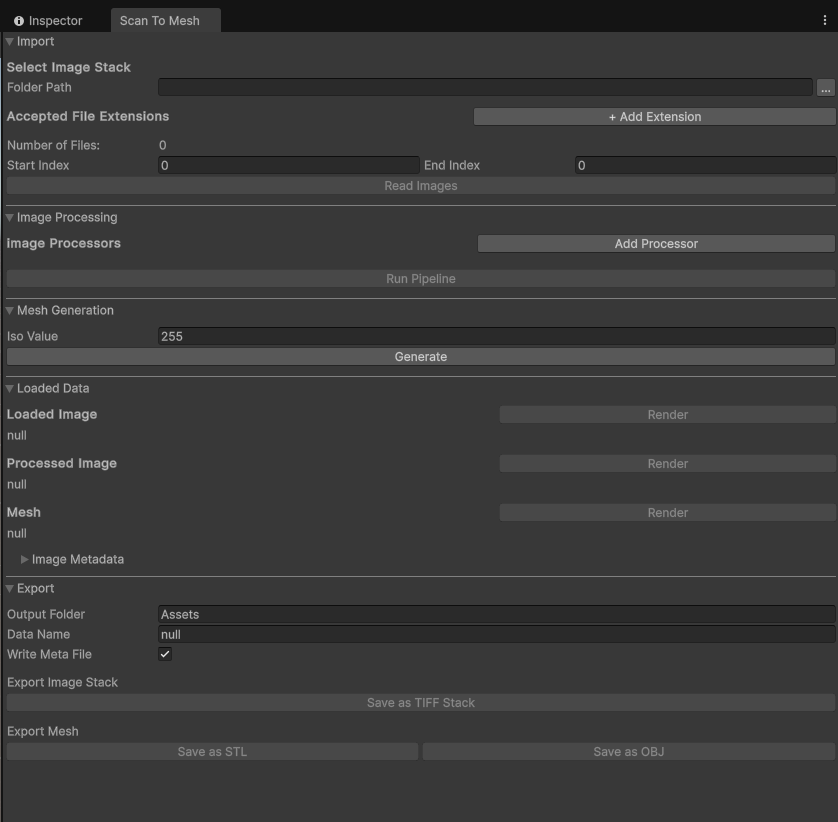

Return to [main page](../README.md)

# Unity

STM can be packaged to Unity.

## Setup

1. Make sure that CSharpHost is build (see [C# setup](CS.md#getting-started)).

2. Copy everything into `Unity_out` via `copy_stm_and_unity_to_unity_out.bat`.

3. Copy `ScanToMesh` from `Unity_out` into `YourUnityProject/Assets/`

4. Unity will automatically load STM.

5. Disable python_runtime DLLs via Unity: `Tools -> ScanToMesh -> Disable Plugin Import` (only one time needed).

6. Open the STM window vie Unity: `Tools -> ScanToMesh -> Show Pipeline`

## Example Images

Tools Tab in Unity

#

Pipeline Window in Unity

##

Return to [top]()

Return to [main page](../README.md)